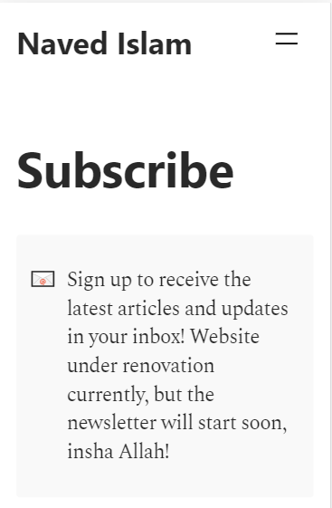

# hugo-callout
Notion-style callouts for your hugo site!




Simply invoke the following shortcode in your `.md` Hugo content files to use these beautiful callouts:

```

```

Simply download the `callout.html` file from this repo, and place in your `themes/[THEME-NAME]/layouts/shortcodes` or `layouts/shortcodes` folder to install this feature on your website.

The style code is included in that same file for convenience, but you can move it to your own `.css` file and modify as you wish 👍🏻 
